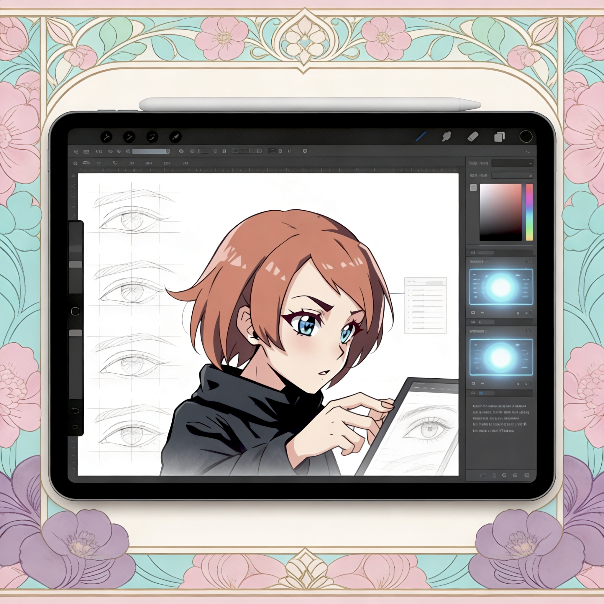

# 🎨 Krita Art Protocol: 60-Day Digital Art Roadmap

> A structured, Obsidian-based training system for intermediate artists returning to digital drawing. Focused on Anime, Semi-Realism, and Advanced Lighting using Krita & Linux.


## 📖 About This Project
This vault is designed as a **"Bootcamp in a Box"**. It provides a day-by-day roadmap to take you from setting up your tablet drivers on Linux to rendering professional-quality portfolio pieces.


## 💭 Why This Vault Exists

> *"Tomorrow" is where dreams go to die.*

As we grow older, life has a way of convincing us that responsibilities come first and passions come... eventually. The sketchbooks gather dust, the drawing tablet sits unplugged, and that fire we had as kids—when we'd spend hours lost in our art—becomes just a distant memory.

This vault exists because I refuse to let "someday" become never.

### Bringing Art Back Home

My Obsidian vault isn't just a note-taking app—it's my **external brain**, my **digital sanctuary**, where I organize everything that matters. It's where thoughts become systems, where chaos becomes clarity. So when I decided to finally return to digital art after years of postponing it, there was only one place it could live: **here, in my world**.

By integrating this 60-day art roadmap into my vault, I'm doing more than learning to draw again. I'm:

- **Making it visible**: No more "I'll start next week." If it's in my vault, it's real.
- **Making it systematic**: Structured folders, progress tracking, and daily accountability.
- **Making it permanent**: This isn't a fleeting motivation—it's part of my knowledge system now.

### From "I Should" to "I Am"

This protocol is for anyone who recognizes themselves in this story:
- The artist who became an adult with "more important things to do"
- The dreamer who's tired of saying "when I have time"
- The creative soul ready to reclaim what was lost

**The best time to start was when you were younger. The second best time is now.**

This vault is my commitment—structured, tracked, and integrated into the place where I think, plan, and grow. Not as a separate "hobby project," but as a core part of who I'm choosing to be.

*If you're reading this, maybe it's time to bring your passions home too.* 🎨

### Key Features
- **60-Day Interactive Roadmap:** Daily tasks with specific time limits.
- **The "1-2-3 Shadow System":** A technical approach to rendering (inspired by Mogoon/WLOP).
- **Tech Stack Optimized:** Specific guides for Arch Linux, Huion Tablets, and Krita workflows.
- **Artist Database:** Deep dives into the styles of *Redum, WLOP, Ilya Kuvshinov, and more*.
- **Progress Tracking:** Automated Dataview dashboards to track your "XP".

## 🛠️ Installation (How to use)

1. **Clone this repo:**
   ```bash
   git clone https://github.com/YOUR-USERNAME/krita-mastery-vault.git
   ```
2. **Open in Obsidian:**
   - Launch Obsidian.
   - Click "Open folder as vault".
   - Select the cloned folder.
3. **Install Recommended Plugins:**
   - **Dataview** (Essential for the Dashboard to work).
   - **Image Toolkit** (Optional, for better reference viewing).

## 📂 Vault Structure
- `00-INDEX`: Your main dashboard.
- `01-CORE-ROADMAP`: Daily guides (Day 1 to 60).
- `02-TECHNIQUES`: Deep technical breakdowns (Shadows, Color, Composition).
- `04-REFERENCE-ARTISTS`: Studies of master artists.
- `05-RESOURCES`: Drivers, Brushes, and Shortcuts.

## 🤝 Credits & References
This roadmap is a compilation of techniques studied from:
- [ArtStation](https://www.artstation.com) (Excellent source for artist discovery and high-quality references)
- Mogoon (Coloso)
- WLOP (Patreon)
- Redum (Pixiv)
